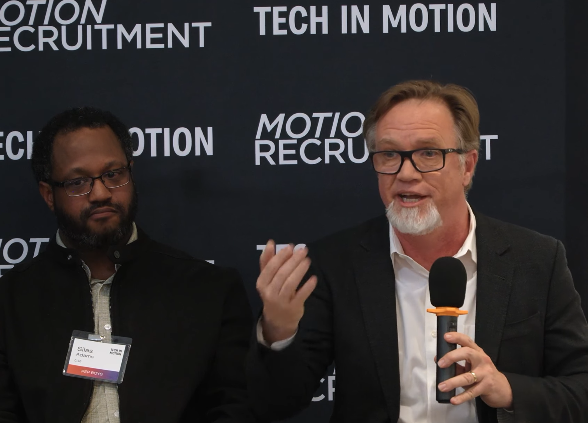

# Matthew Franz — Publications, Presentations, & Open Source Projects

  

Welcome to my personal publications repository. This project serves as an archive of papers, articles, slide decks, and open-source tools I have authored, co-authored, or contributed to since 1998.

My work spans several areas of information security, with a strong focus on **Industrial Control Systems (ICS/SCADA) Security**, **Vulnerability Discovery**, **Protocol Security**, and **Agentic Security Operations**.

Also see my blogs over the years: at [blog.mdfranz.com](https://blog.mdfranz.com/) [medium.com/@mdfranz](https://medium.com/@mdfranz) and [substack](https://matthewfranz.substack.com/) and [seclectech.wordpress.com](https://seclectech.wordpress.com/)

---

## 🌟 Key Highlights

*   **[Agentic Security Operations (2026)](#2026):** Currently researching the intersection of Generative AI, LLMs, and autonomous agents in modern cyber defense and incident response.
*   **[SCADA & ICS Protocol Security (2003–2006)](#2003–2006):** Pioneered early research on industrial protocols (Modbus, ICCP), threat modeling via attack trees, and co-developed the initial Nessus SCADA assessment plugins in partnership with Tenable.
*   **[Trinux (1998)](#1998):** Developed and launched the first security-oriented Linux distribution, pioneering the concept of ramdisk-based live security environments (precursor to modern toolsets like Kali Linux).

---

## 📚 Publications & Presentations

### 2026
*   **[Leveraging AI for Advanced Cyber Defense](https://events.techinmotion.com/ai-cyber-defense-2026)** — Panel presentation at Tech in Motion. [Watch the video](https://www.youtube.com/watch?v=YsQvAeBC1J0).
*   **[Agentic Security Operations: Machine Speed Response and the Fog of Cyberwar](./agentic-secops.md)** — Comprehensive references on autonomous security operations. [Download Slides (PDF)](./agentic-secops-bespin-jan-26.pdf).

### 2025
*   **[Beyond the Burner: Practical Digital Security & Privacy for Organizers](./Beyond-the-Burner-MD-Convening-July-26-2025-Final.pdf)** — Maryland Indivisible Convening presentation on personal/organizational security.

### 2024
*   **[From DevOps to LLM Ops: Generative AI for Infra Engineers](./devops-to-llmops-april-2024.pdf)** — Presented at [DevOps Columbia](https://www.meetup.com/devops-columbia/).

### 2022
*   **[Cloud Native Infrastructure with Azure: Building and Managing Cloud Native Applications](https://www.amazon.com/Cloud-Native-Infrastructure-Azure-Applications/dp/1492090964/)** — Co-authored chapter and developer exercises on cloud messaging systems.

### 2019
*   **[Hiring on Pragmatic Ops Weekly Podcast](https://player.fm/series/pragmatic-ops-weekly/episode-20-hiring-with-matt-franz)** — Interview on recruiting and hiring practices for operations teams.

### 2017
*   **[Bringing DevSecOps to ICS](https://www.youtube.com/watch?v=mPx6CH3fHHI&)** — Video presentation on applying DevSecOps paradigms to Industrial Control Systems and the 2017 [S4](https://s4xevents.com/)

### 2011
*   **Digital Bond Podcast on DoD Smart Grid Deployments** — Discussion with Gerry Gallagher on smart grid security in military installations.

### 2010
*   **[Advanced Metering Implementations: Addressing Security in DoD Applications](./virag-franz-ami-dod.pdf)** — Co-authored paper with Pete Virag.
*   **[A Maze of Tiny Fuzzers All Alike](./franz-fuzzing-maze-cert-2010.pdf)** — Presentation on vulnerability discovery at the CERT Vulnerability Disclosure Workshop. [View SEI Library Link](https://resources.sei.cmu.edu/asset_files/Presentation/2010_017_001_53935.pdf).
*   **[RSA Panel Session on Smart Meter Security](https://www.wired.com/2010/03/smart-grids-done-smartly/)** — Panel on smart grid vulnerabilities covered by Wired Magazine.
### 2009
*   **[Final Exam for CIS170 (Security Fundamentals)](./cis170_spring2009_final.pdf)** — Prepared for Frederick Community College.

### 2007
*   **[Cisco OSI Stack Vulnerability](https://www.kb.cert.org/vuls/id/145825/)** — Vulnerability discovery and disclosure (VU#145825).
*   **OPC Security Whitepaper** — Sponsored research deliverable on OPC protocol security (available via Digital Bond subscriber portal).
*   **ICCP Exposed** — Conference paper and presentation on ICCP and OSI protocol security at the inaugural S4 Conference.

### 2006
*   **[Tenable SCADA Plugins](https://www.businesswire.com/news/home/20060801005188/en/Tenable-Digital-Bond-Add-SCADA-Plugins-Nessus)** — Co-developed early SCADA vulnerability detection plugins for Nessus in partnership with Tenable.
*   **[LiveData ICCP Heap Overflow](https://www.kb.cert.org/vuls/id/190617/)** — Vulnerability discovery and disclosure (VU#190617).
*   **[A Rough Start of a Toolset for Assessing J2EE Apps](./franz-basic-j2ee-tools-owasp-austin.pdf)** — Presented at the Austin OWASP Chapter Meeting.
*   **[The Challenge of an Open Source Testing Framework for Control Systems](./franz-pcsf-sec-testing.pdf)** — Presented at the Process Control Security Requirements Forum (PCSF).
*   **[SCADA Vulnerability Discovery and Disclosure](./franz-pcsf-disclosure-final.pdf)** — Presentation at PCSF Spring 2006. Also covered by [The Register](https://www.theregister.co.uk/2006/06/19/scada_flaw_debate/) and [SecurityFocus](https://www.securityfocus.com/news/11396).

### 2005
*   **[The Use of Attack Trees in Assessing SCADA Protocols](./SCADA-Attack-Trees-IISW.pdf)** — Early research on SCADA threat modeling (co-authored with Eric Byres and Darrin Miller).
*   **[Uncovering Cyber Flaws](./InTech-CyberFlaws.pdf)** — Article on vulnerability assessment methodology.

### 2004
*   **[ModbusFW: Deep Packet Inspection for Industrial Ethernet](./franz-niscc-modbusfw-may04.pdf)** — Whitepaper presented at the National Infrastructure Security Co-ordination Centre (NISCC).
*   **[Protocol Implementation Testing: Challenges & Opportunities](./franz-niscc-workshop-jan04.pdf)** — Whitepaper presented at the NISCC.
*   **[ISA SP99 Panel](https://www.businesswire.com/news/home/20040326005280/en/Industry-Panel-Discusses-Manufacturing-Control-Systems-Security)** — Industry panel discussing manufacturing control systems security standards.

### 2003
*   **[Separating Fact from FUD: BGP Vulnerability Testing](https://www.blackhat.com/presentations/bh-usa-03/bh-us-03-convery-franz-v3.pdf)** — Presented at BlackHat USA and NANOG. [Watch the recording on YouTube](https://www.youtube.com/watch?v=p2AUMDpDKLA) *(note: low-quality audio/video).*
*   **[Vulnerability Testing of Industrial Network Devices](./franz-isa-device-testing-oct03.pdf)** — Early work on testing control system protocols.
*   **[Integrating IT and Control System Security: A Vendor-Researcher Perspective](./franz-integrating-it-control-system-security-mar03.pdf)** — Whitepaper exploring convergence challenges in IT and OT.
*   **[Industrial Ethernet Security: Threats and Countermeasures](./franz-miller-industrial-ethernet-sec-03.pdf)** — Research paper co-authored with Darrin Miller (Cisco Systems).

### 2002
*   **[Secure IT with Linux (InfoWorld)](https://www.infoworld.com/article/2668545/secure-it-with-linux.html)** — Trinux was profiled as a leading open-source security tool.

### 2001
*   **[How Secure is Secure: Threat-Oriented Product Testing](./core01-howsecure.pdf)** — Presented at CanSecWest '01.
*   **[SANS Institute Trinux Whitepaper](https://www.sans.org/reading-room/whitepapers/unix/paper/327)** — Independent review of Trinux published by the SANS Reading Room.

### 1998
*   **[Trinux: The Original Security-Oriented Linux Distribution](http://trinux.sourceforge.net/legacy/)** — Launched Trinux, the first diskette-based, ramdisk-only Linux distribution designed specifically for network security monitoring and vulnerability scanning.

